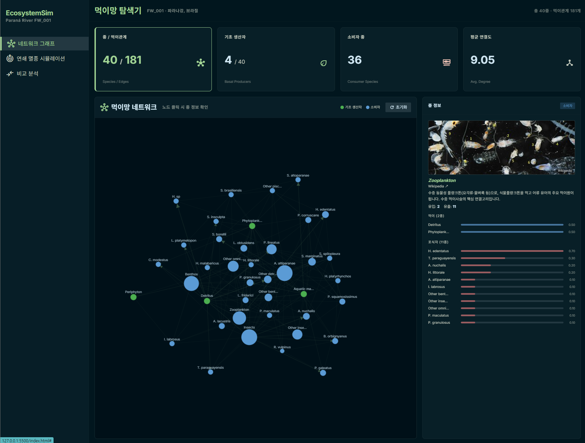
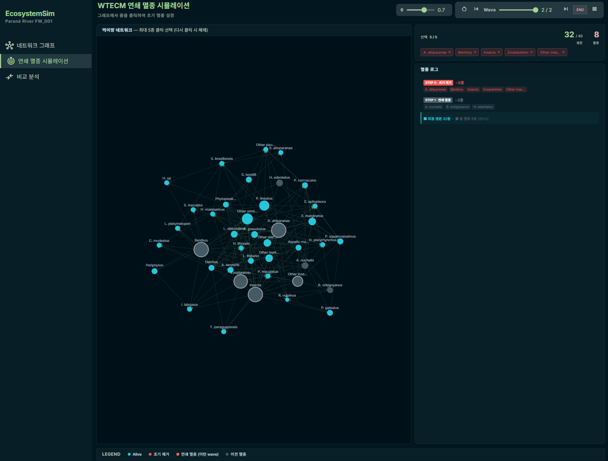
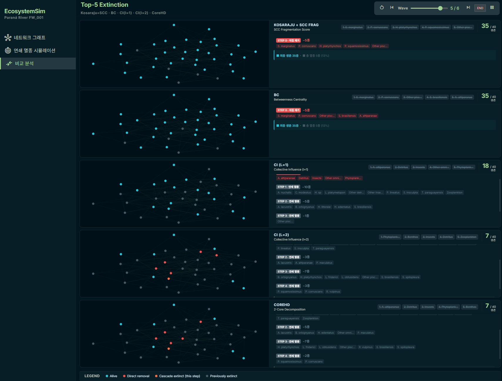

# EcosystemSim — Paraná River Food Web

파라나 강 담수 생태계 먹이그물(FW_001)의 멸종 연쇄 시뮬레이션 및 네트워크 분석 웹 애플리케이션.  
순수 HTML/CSS/JS로 구현되어 별도 서버 없이 GitHub Pages에서 실행된다.

**Live Demo:** https://jaydenpark00.github.io/parana_sim/

---

## 스크린샷

### 네트워크 그래프


### 연쇄 멸종 시뮬레이션


### Top-5 Extinction 비교 분석


---

## 기술 스택

| 항목 | 내용 |
|------|------|
| 언어 | HTML5, CSS3, Vanilla JavaScript (ES6+) |
| 그래프 시각화 | [D3.js v7](https://d3js.org/) — force simulation, zoom/pan, SVG 렌더링 |
| 스타일링 | [Tailwind CSS v3](https://tailwindcss.com/) (CDN, JIT) |
| 아이콘 | [Material Symbols](https://fonts.google.com/icons) (Google Fonts) |
| 종 이미지 | Wikipedia REST API, iNaturalist API (런타임 fetch) |
| 배포 | GitHub Pages (정적 호스팅) |

외부 빌드 도구·번들러 없음. `index.html` 하나로 모든 탭이 동작한다.

---

## 탭 구성

### 1. 네트워크 그래프 (`network-view.js`)
- D3 force-directed simulation — 노드 드래그, 스크롤 줌/패닝 (초기 1.2×)
- 노드 클릭 시 종 상세 정보 패널: Wikipedia 설명, IUCN 보전 등급, iNaturalist 사진, 먹이·포식자 가중치 바
- 바살 종(기초 생산자)과 소비자 색상 구분

### 2. 연쇄 멸종 시뮬레이션 (`wtecm-sim.js`)
- 동일 D3 force simulation 기반 — 드래그·줌 지원
- 그래프에서 최대 **5종** 클릭 선택 → 선택 즉시 WTECM cascade 실행
- θ 슬라이더(0.1~1.0) 실시간 조절 → 선택 유지한 채 cascade 즉시 재계산
- Wave 단계별 재생/정지/스텝/슬라이더 컨트롤
- 선택 종 chip UI(개별 ✕ 해제), 멸종 로그 실시간 업데이트

### 3. Top-5 Extinction 비교 분석 (`comparison.js`)
- 5개 알고리즘(Kosaraju+SCC Frag, BC, CI l=1, CI l=2, CoreHD)이 선별한 top-5를 동시에 비교
- 정적 레이아웃(force simulation 500 tick 사전 계산) — 5개 패널 동일 좌표 사용
- 공통 wave 컨트롤로 5개 패널 동기 재생
- 각 패널: 생존 종 수, 알고리즘 랭킹 chip, 멸종 로그

---

## 파일 구조

```
sim/
├── index.html              # 단일 페이지 — 모든 탭 포함, 스크립트 로드 순서 중요
├── css/
│   └── style.css
├── js/
│   ├── data.js             # SPECIES_NAMES, RAW_EDGES, SELF_LOOP_WEIGHTS,
│   │                       # WIKI_TITLES, SPECIES_DESC_KO
│   ├── graph-core.js       # buildGraph(), runCascade()
│   ├── metrics.js          # computeBC(), computeCI(), computeCI1(),
│   │                       # computeSCCKosaraju(), computeSCCFragScore(),
│   │                       # computeCoreHD(), buildWaveStates()
│   ├── network-view.js     # 네트워크 그래프 탭 — D3 simulation, showInfo()
│   ├── comparison.js       # 비교 분석 탭 — cmpNodeColor(), drawCmpPanel()
│   ├── wtecm-sim.js        # 연쇄 멸종 탭 — buildWtecmD3(), wtecmToggleNode()
│   ├── view-router.js      # showView() — 탭 전환
│   ├── main.js             # initGraph() 호출
│   └── tailwind-config.js
└── images/
```

> **스크립트 로드 순서:** `data → graph-core → network-view → metrics → comparison → wtecm-sim → view-router → main`  
> `wtecm-sim.js`가 `comparison.js`의 `cmpNodeColor()`, `shortName()`을 참조하므로 반드시 뒤에 로드해야 한다.

---

## 데이터셋

- **종 수:** 40종 (어류 26종 + 무척추동물·플랑크톤·식물·비생물 에너지원 14개 그룹)
- **엣지 수:** 181개 유향 가중치 엣지 (self-loop 4개 별도 관리)
- **엣지 형식:** `[prey_id, predator_id, weight]` — weight는 포식자의 총 먹이 의존도에서 해당 먹이가 차지하는 비율 (0~1)
- **출처:** Parana River freshwater food web (FW_001)

| 그래프 | 구성 | 용도 |
|--------|------|------|
| G_wtecm | 181간선 + self-loop 4개 | WTECM 멸종 cascade |
| G_alg | 181간선 (self-loop 제거) | 알고리즘 랭킹 계산 |

self-loop 4종: Hoplias malabaricus (0.2), Other piscivores (0.1), Rhaphiodon vulpinus (0.1), Serrasalmus marginatus (0.1)

---

## 알고리즘

### Kosaraju + SCC Fragmentation Score

원본·전치 그래프 2패스 DFS로 SCC 탐지. 각 종 제거 후 파편화 정도를 수치화.

$$\text{Frag Score}(v) = \Delta N_{SCC} + \frac{L_{before} - L_{after}}{L_{before}}$$

### Betweenness Centrality (BC)

Brandes 알고리즘, **유방향** 그래프. `nx.betweenness_centrality(G_alg, weight=None)`과 일치.

$$BC(v) = \sum_{s \neq v \neq t} \frac{\sigma_{st}(v)}{\sigma_{st}} \cdot \frac{1}{(N-1)(N-2)}$$

### Collective Influence (CI l=1, l=2)

$$CI_l(v) = (k_v - 1) \sum_{j \in \partial Ball(v,l)} (k_j - 1)$$

무방향 그래프 기준. ∂Ball(v, l): v로부터 정확히 l홉 거리의 노드 집합.

### CoreHD

반복적 2-core 해체. 매 iteration마다 2-core 내 최고 degree 노드 제거 (tie → id 오름차순).

### WTECM Cascade

$$\frac{rem_v}{initial_v} \leq (1 - \theta) + \varepsilon \quad (\varepsilon = 10^{-9})$$

staged cascade 방식 — 동일 wave의 멸종 대상을 모두 계산한 뒤 한 번에 반영.

---

## References

- Morone, F., & Makse, H. A. (2015). Influence maximization in complex networks through optimal percolation. *Nature*, 524, 65–68.
- Brandes, U. (2001). A faster algorithm for betweenness centrality. *Journal of Mathematical Sociology*, 25(2), 163–177.
- Sharir, M. (1981). A strong-connectivity algorithm and its applications in data flow analysis. *Computers & Mathematics with Applications*, 7(1), 67–72.
- Zdeborová, L., Zhang, P., & Zhou, H. J. (2016). Fast and simple decycling and dismantling of networks. *Scientific Reports*, 6, 37812.
