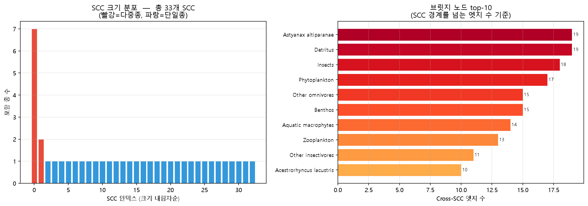
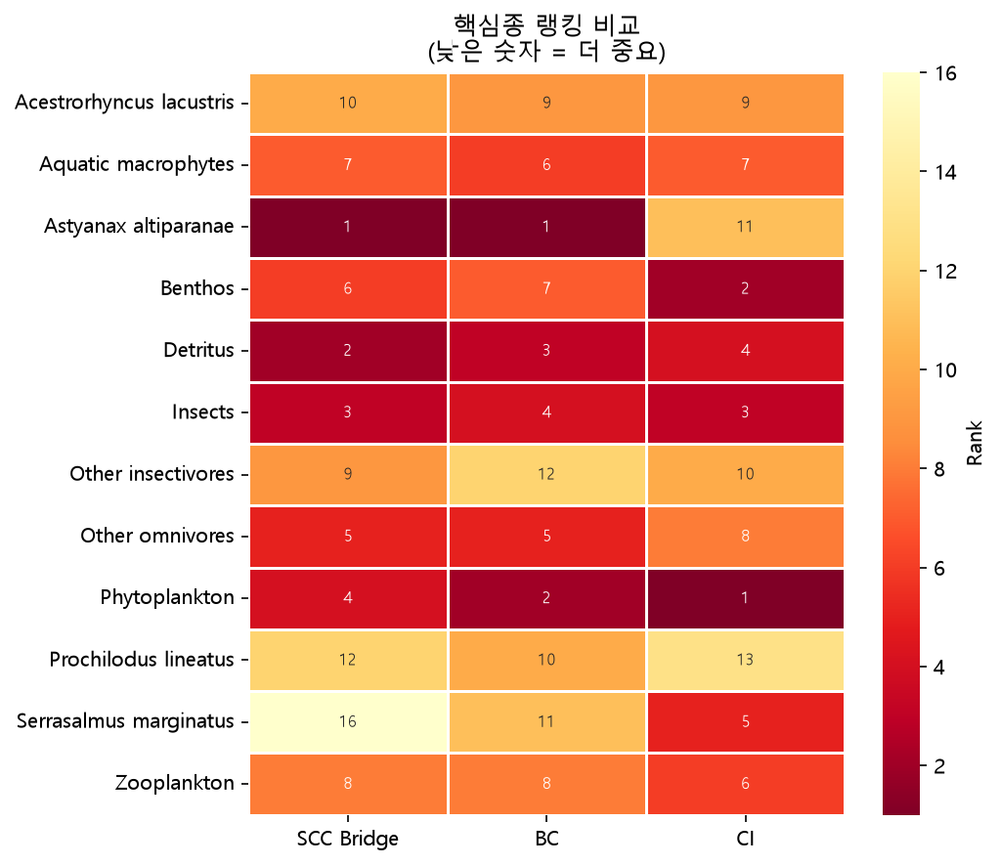
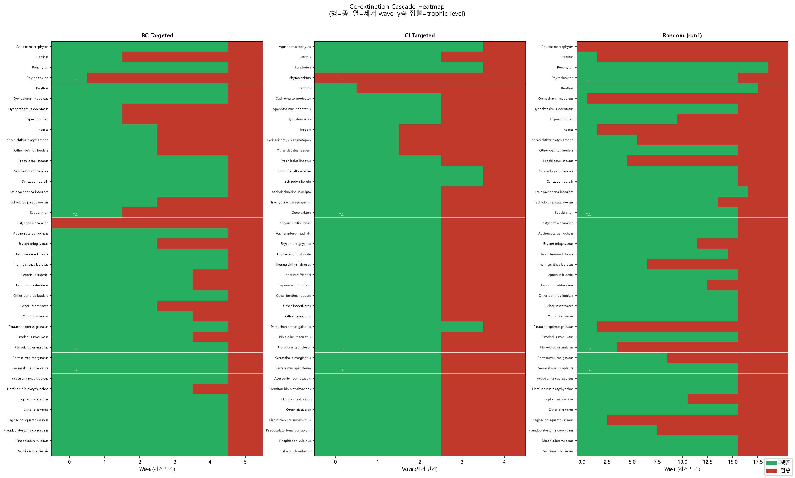

# EcosystemSim — Paraná River Food Web

파라나 강 담수 생태계 먹이그물(FW_001)의 멸종 연쇄 시뮬레이션 및 네트워크 분석 도구.

**Live Demo:** https://jaydenpark00.github.io/parana_sim/

---

## 데이터셋

- **종 수:** 40종 (어류 26종 + 무척추동물·플랑크톤·식물·비생물 에너지원 14개 그룹)
- **엣지 수:** 164개 유향 가중치 엣지
- **엣지 형식:** `[prey_id, predator_id, weight]` — weight는 포식자의 총 먹이 의존도에서 해당 먹이가 차지하는 비율 (0~1)
- **출처:** Parana River freshwater food web (FW_001)

---

## 알고리즘

### 1. 강한 연결 요소 (SCC) 탐지

그룹 내 임의의 두 종 사이에 양방향 유향 경로가 존재하는 최대 부분그래프를 탐지한다. 먹이그물에서 SCC는 순환 포식 관계를 형성하는 종 집합을 의미한다.

#### Tarjan's Algorithm

DFS 스택 기반의 단일 패스 알고리즘. 각 노드에 발견 인덱스(`idx`)와 도달 가능한 최소 인덱스(`low`)를 부여하고, `low[v] == idx[v]`가 되는 시점에 스택에서 SCC를 추출한다.

- **시간 복잡도:** O(V + E)
- **특징:** 싱크(sink) SCC를 먼저 발견하므로 위상 정렬의 역순으로 출력됨

```
for each node v:
    idx[v] = low[v] = cnt++
    push v to stack
    for each neighbor w of v:
        if w not visited: recurse(w); low[v] = min(low[v], low[w])
        elif w on stack:  low[v] = min(low[v], idx[w])
    if low[v] == idx[v]:
        pop stack until v → this is one SCC
```

#### Kosaraju's Algorithm

원본 그래프와 전치(역방향) 그래프를 각각 DFS하는 2패스 알고리즘.

1. **1패스:** 원본 그래프 DFS → 종료 순서(`finishOrder`) 기록
2. **2패스:** 전치 그래프를 역 종료 순서로 DFS → 각 DFS 트리 = SCC

- **시간 복잡도:** O(V + E)
- **특징:** Tarjan과 동일한 SCC를 탐지하나 발견 순서가 다름. 두 결과를 비교해 알고리즘 정확성을 교차 검증

두 알고리즘의 결과를 SCC 구성원 집합의 서명(signature)으로 비교해 일치 여부를 실시간으로 표시한다.

---

### 2. 브리지 노드 (Bridge Node)

서로 다른 SCC 사이의 교차 엣지(cross-SCC edge)에 관여하는 종. 점수는 해당 종이 관여하는 교차 엣지의 수로 정의된다.

```
score(v) = |{e = (s, t) : scc(s) ≠ scc(t), s = v or t = v}|
```

점수가 높을수록 SCC 간 에너지 흐름에서 차지하는 비중이 크며, 제거 시 먹이그물 연결성 단절 위험이 높다.



---

### 3. 매개 중심성 (Betweenness Centrality, BC)

Brandes 알고리즘으로 계산한 비방향 매개 중심성. 노드 v의 BC는 v를 통과하는 최단 경로의 비율이다.

$$BC(v) = \sum_{s \neq v \neq t} \frac{\sigma_{st}(v)}{\sigma_{st}}$$

- σ_st: s→t 최단 경로 수
- σ_st(v): 그 중 v를 거치는 경로 수
- 정규화: `/ (N-1)(N-2)`

**시간 복잡도:** O(V · (V + E))

BFS로 최단 경로를 순방향 계산 후, 스택을 역순으로 pop하며 의존도(δ)를 역전파한다.

---

### 4. 집단 영향력 (Collective Influence, CI)

Morone & Makse (2015) 제안 지표. 단순 연결도(degree)가 아닌 2홉(hop) 이웃의 연결도를 고려해 네트워크 분리에 가장 효과적인 노드를 식별한다.

$$CI_2(v) = (k_v - 1) \sum_{j \in \partial Ball(v,2)} (k_j - 1)$$

- k_v: 노드 v의 차수
- ∂Ball(v, 2): v로부터 정확히 2홉 거리의 노드 집합

**구현:** 1홉 이웃 집합을 먼저 구한 뒤, 각 1홉 이웃의 이웃 중 v 및 v의 1홉에 속하지 않는 노드를 2홉 경계로 수집한다.

---

### 5. 연쇄 멸종 시뮬레이션 (Cascade Extinction)

먹이 의존도 기반의 반복적 멸종 모델.

**멸종 조건:** 포식자 v의 잔존 먹이 가중치 합이 초기값의 70% 미만으로 감소하면 멸종

$$\frac{\sum_{u \notin Extinct} w_{uv}}{\sum_{all} w_{uv}} < 0.7$$

**알고리즘:**
```
extinct ← initial_removal
repeat:
    for each non-extinct, non-basal node v:
        remaining = sum of weights from non-extinct prey of v
        if remaining / v.initialPreyWeight < 0.7:
            mark v as newly extinct
    extinct ← extinct ∪ newly_extinct
until no new extinctions
```

각 반복을 "wave"로 기록해 단계별 연쇄 멸종 과정을 시각화한다.

---

### 6. 3-Way Comparison

BC, CI, SCC Bridge 세 지표로 각각 상위 5종을 제거한 뒤 연쇄 멸종 시뮬레이션을 실행해 결과를 비교한다.

| 지표 | 기반 | 특징 |
|------|------|------|
| BC (매개 중심성) | 최단 경로 | 정보·에너지 흐름의 병목 탐지 |
| CI (집단 영향력) | 2홉 이웃 차수 | 네트워크 분리 최적화 |
| SCC Bridge | SCC 간 교차 엣지 | 순환 구조 간 흐름 단절 |

**핵심종 랭킹 비교 히트맵 (낮은 숫자 = 더 중요)**



**연쇄 멸종 카스케이드 히트맵**



---

### 7. Force-Directed Graph Layout

D3.js `forceSimulation`으로 네트워크를 시각화한다.

| Force | 파라미터 | 역할 |
|-------|----------|------|
| `forceLink` | distance=100, strength=0.4 | 엣지 길이 유지 |
| `forceManyBody` | strength=−600 | 노드 간 반발력 |
| `forceCollide` | radius=22 | 노드 겹침 방지 |
| `forceCenter` | cx, cy | 전체 중심 유지 |

엣지 두께는 가중치에 비례(`stroke-width = weight × 2`), 노드 크기는 out-degree에 비례한다.

---

## 디렉토리 구조

```
sim/
├── index.html
├── css/
│   └── style.css
├── js/
│   ├── data.js          # 종 목록, 엣지 행렬, Wikipedia 제목, 한국어 설명
│   ├── graph-core.js    # buildGraph(), runCascade()
│   ├── metrics.js       # computeBC(), computeCI(), computeSCC(), computeSCCKosaraju()
│   ├── network-view.js  # D3 그래프 렌더링, 종 정보 패널
│   ├── scc-analysis.js  # SCC 분석 탭 렌더링
│   ├── comparison.js    # 3-Way Comparison 탭
│   ├── view-router.js   # 탭 전환
│   └── tailwind-config.js
└── images/              # 분석 결과 이미지
```

---

## References

- Morone, F., & Makse, H. A. (2015). Influence maximization in complex networks through optimal percolation. *Nature*, 524, 65–68.
- Brandes, U. (2001). A faster algorithm for betweenness centrality. *Journal of Mathematical Sociology*, 25(2), 163–177.
- Tarjan, R. (1972). Depth-first search and linear graph algorithms. *SIAM Journal on Computing*, 1(2), 146–160.
