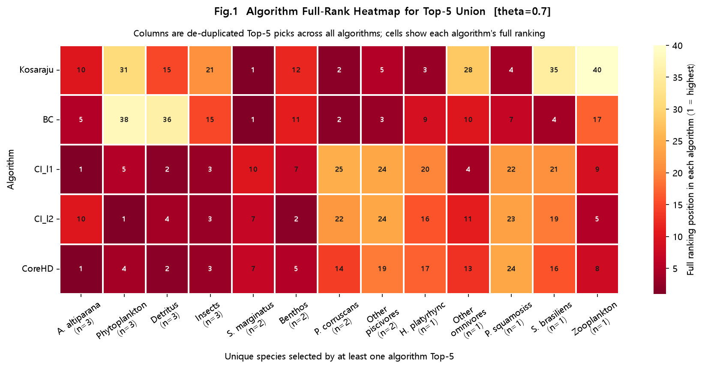
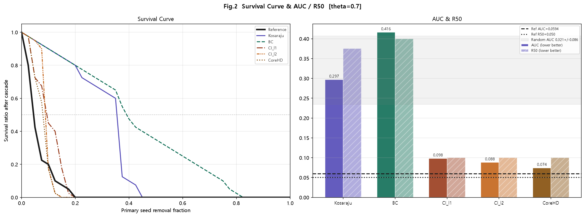
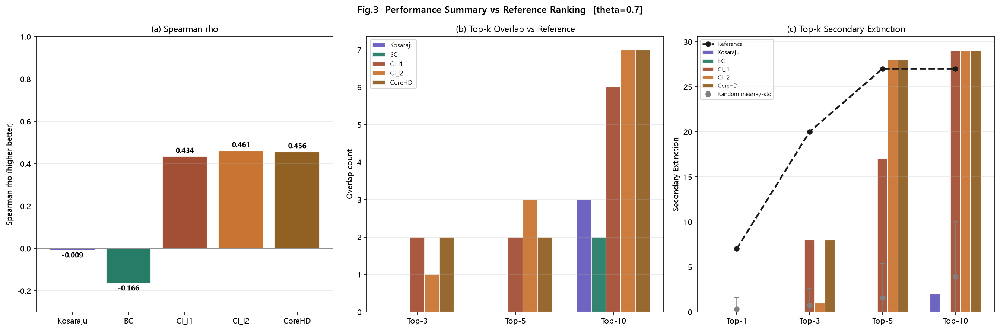
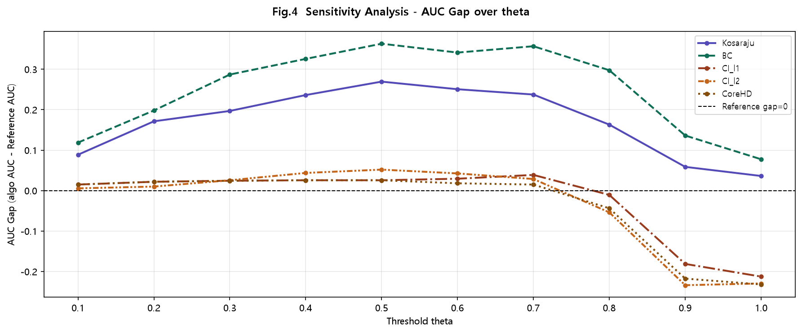

# EcosystemSim — Paraná River Food Web

파라나 강 담수 생태계 먹이그물(FW_001)의 멸종 연쇄 시뮬레이션 및 네트워크 분석 도구.

**Live Demo:** https://jaydenpark00.github.io/parana_sim/

---

## 데이터셋

- **종 수:** 40종 (어류 26종 + 무척추동물·플랑크톤·식물·비생물 에너지원 14개 그룹)
- **엣지 수:** 181개 유향 가중치 엣지 (self-loop 4개 별도 관리)
- **엣지 형식:** `[prey_id, predator_id, weight]` — weight는 포식자의 총 먹이 의존도에서 해당 먹이가 차지하는 비율 (0~1)
- **출처:** Parana River freshwater food web (FW_001)

### 그래프 구성

| 그래프 | 설명 | 용도 |
|--------|------|------|
| G_wtecm | 181간선 + self-loop 4개 (`SELF_LOOP_WEIGHTS`) | WTECM 멸종 cascade |
| G_alg | 181간선 (self-loop 제거) | 알고리즘 랭킹 (BC, CI, SCC, CoreHD) |

self-loop 4종: Hoplias malabaricus (0.2), Other piscivores (0.1), Rhaphiodon vulpinus (0.1), Serrasalmus marginatus (0.1)

---

## 알고리즘

### 1. 강한 연결 요소 (SCC) 탐지 — Kosaraju

원본 그래프와 전치(역방향) 그래프를 각각 DFS하는 2패스 알고리즘.

1. **1패스:** 원본 그래프 DFS → 종료 순서(`finishOrder`) 기록
2. **2패스:** 전치 그래프를 역 종료 순서로 DFS → 각 DFS 트리 = SCC

**시간 복잡도:** O(V + E)

---

### 2. SCC Fragmentation Score

각 종을 제거했을 때 SCC 구조가 얼마나 파편화되는지 정량화. Python 파이프라인과 동일한 계산식 사용.

$$\text{Frag Score}(v) = \Delta N_{SCC} + \frac{L_{before} - L_{after}}{L_{before}}$$

- ΔN_SCC: 제거 후 실제 SCC 수 − 기대 SCC 수 (v가 자명 SCC였으면 −1 보정, 비자명이면 보정 없음)
- L_before / L_after: 제거 전후 최대 SCC 크기

점수가 높을수록 제거 시 먹이그물 순환 구조가 크게 붕괴된다.

---

### 3. 매개 중심성 (Betweenness Centrality, BC)

Brandes 알고리즘으로 계산한 무방향 매개 중심성.

$$BC(v) = \sum_{s \neq v \neq t} \frac{\sigma_{st}(v)}{\sigma_{st}} \cdot \frac{2}{(N-1)(N-2)}$$

**시간 복잡도:** O(V · (V + E)) — BFS 순방향 후 스택 역전파

---

### 4. 집단 영향력 (Collective Influence, CI)

Morone & Makse (2015). G_alg 무방향 그래프 기준.

**CI l=2:**
$$CI_2(v) = (k_v - 1) \sum_{j \in \partial Ball(v,2)} (k_j - 1)$$

**CI l=1:**
$$CI_1(v) = (k_v - 1) \sum_{j \in \partial Ball(v,1)} (k_j - 1)$$

∂Ball(v, l): v로부터 정확히 l홉 거리의 노드 집합

---

### 5. CoreHD

반복적 2-core 해체 기반 랭킹.

```
while 남은 노드가 있을 때:
    현재 그래프에서 2-core 계산
    2-core 내 degree 최대 노드 제거 (tie → id 오름차순)
    2-core가 없으면 나머지를 degree 순 정리
```

제거된 순서가 핵심종 랭킹 (먼저 제거될수록 score 높음).

---

### 6. 연쇄 멸종 시뮬레이션 (WTECM)

먹이 의존도 기반 반복 멸종 모델. θ = 0.7.

**멸종 조건:** 먹이 손실 비율이 θ 이상이면 멸종

$$\frac{rem_v}{initial_v} < 1 - \theta \quad (\text{즉, 먹이의 70\% 이상 손실})$$

self-loop 보유 종은 자신이 살아있는 동안 self-loop weight를 rem에 항상 포함.

```
extinct ← initial_removal
repeat:
    for each non-extinct, non-basal node v:
        rem = Σ w(u→v) for u ∉ extinct
        rem += SELF_LOOP_WEIGHTS[v]  # if exists
        if rem / v.initialPreyWeight < (1 - θ):
            mark v extinct
until no new extinctions
```

---

### 7. 5-Way 비교 분석

5개 지표로 각각 상위 5종을 제거한 뒤 WTECM cascade를 실행해 결과를 비교한다.

| 지표 | 기반 그래프 | 특징 |
|------|-------------|------|
| BC | G_alg 무방향 | 최단 경로 병목 탐지 |
| CI l=2 | G_alg 무방향 | 2홉 이웃 기반 네트워크 분리 |
| CI l=1 | G_alg 무방향 | 1홉 이웃 기반 (빠른 근사) |
| SCC Frag Score | G_alg 유방향 | SCC 구조 파편화 최대화 |
| CoreHD | G_alg 무방향 | 2-core 반복 해체 |

---

## 디렉토리 구조

```
sim/
├── index.html
├── css/
│   └── style.css
├── js/
│   ├── data.js           # 종 목록, RAW_EDGES, SELF_LOOP_WEIGHTS, Wikipedia 제목, 한국어 설명
│   ├── graph-core.js     # buildGraph(), runCascade()
│   ├── metrics.js        # computeBC(), computeCI(), computeCI1(), computeSCCFragScore(),
│   │                     # computeCoreHD(), computeSCC(), computeSCCKosaraju()
│   ├── network-view.js   # D3 force-directed 그래프, 종 정보 패널 (Wikipedia/iNaturalist)
│   ├── scc-analysis.js   # SCC 분석 탭 — 응집 그래프, 브리지 랭킹, SCC별 핵심종
│   ├── comparison.js     # 5-Way 비교 분석 탭
│   ├── view-router.js    # 탭 전환
│   └── tailwind-config.js
└── images/
```

---

## 분석 결과

### Fig.1 — Algorithm Full-Rank Heatmap (Top-5 Union)



5개 알고리즘이 top-5로 선별한 종들의 합집합(13종)에 대해 각 알고리즘의 전체 랭킹 위치를 히트맵으로 표시. 색이 진할수록(낮은 숫자) 해당 알고리즘이 그 종을 중요하게 평가한 것. A. altiparana, Phytoplankton, Detritus, Insects가 3개 이상 알고리즘에서 top-5에 선택됨.

---

### Fig.2 — Survival Curve & AUC/R50



5개 알고리즘의 순차 제거 생존 곡선(좌) 및 AUC·R50 지표(우). AUC·R50 모두 낮을수록 생태계를 빠르게 붕괴시킨다는 의미. Kosaraju가 AUC 0.297로 가장 낮고, CI_l1·CI_l2·CoreHD는 random baseline(AUC ≈ 0.321)과 유사하거나 상회.

---

### Fig.3 — Performance Summary vs Reference Ranking



(a) Spearman ρ: CI_l2(0.461) > CoreHD(0.456) > CI_l1(0.434) 순으로 reference ranking과 상관성이 높음. BC(-0.166)는 음의 상관. (b) Top-k Overlap: CoreHD가 top-10에서 reference와 7종 일치로 최고. (c) Top-k Secondary Extinction: 제거 종 수가 늘수록 모든 알고리즘이 reference에 수렴하나, top-1 단독 제거에서는 cascade가 거의 없음(θ=0.7 특성).

---

### Fig.4 — Sensitivity Analysis (AUC Gap over θ)



θ=0.1~1.0 범위에서 알고리즘별 AUC gap(= 알고리즘 AUC − reference AUC). gap > 0이면 reference보다 나쁜 것. BC는 전 구간에서 gap이 크고, CI·CoreHD는 θ≤0.7에서 거의 0에 근접. θ≥0.8부터 CI·CoreHD가 reference보다 오히려 나은 음수 gap 구간 진입.

---

## References

- Morone, F., & Makse, H. A. (2015). Influence maximization in complex networks through optimal percolation. *Nature*, 524, 65–68.
- Brandes, U. (2001). A faster algorithm for betweenness centrality. *Journal of Mathematical Sociology*, 25(2), 163–177.
- Sharir, M. (1981). A strong-connectivity algorithm and its applications in data flow analysis. *Computers & Mathematics with Applications*, 7(1), 67–72.
- Zdeborová, L., Zhang, P., & Zhou, H. J. (2016). Fast and simple decycling and dismantling of networks. *Scientific Reports*, 6, 37812.
